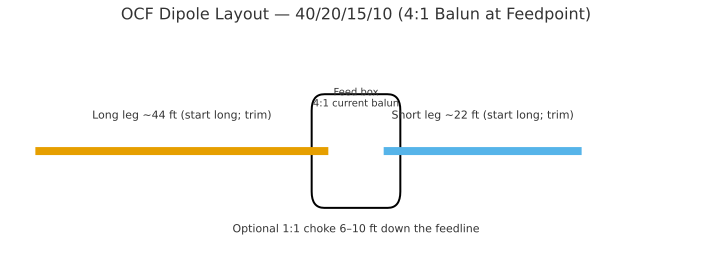
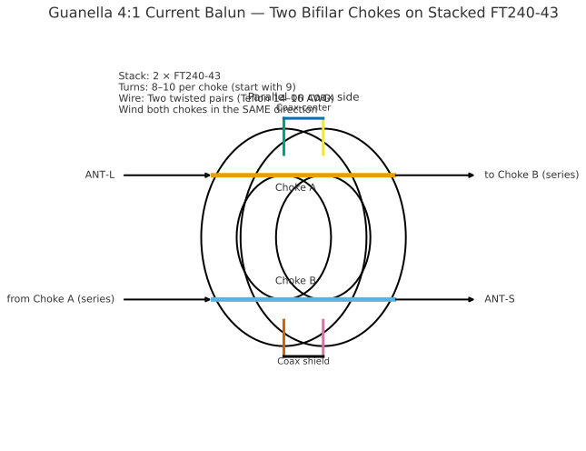
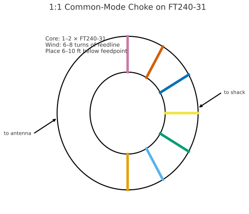
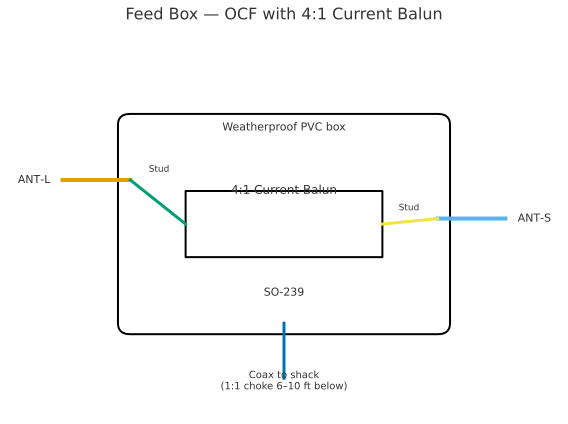
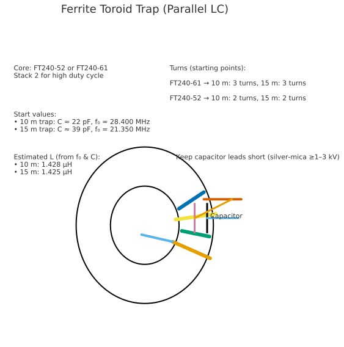

# OCF Multiband Dipole (40/20/15/10) — Build Manual (4:1 Current Balun)

**Design intent:** A reliable off‑center‑fed (OCF) dipole that covers **40 m, 20 m, 15 m, and 10 m** by harmonic operation. This version uses a **4:1 current balun** (Guanella) at the feedpoint. A **1:1 common‑mode choke** on the feedline is recommended 6–10 ft below the feedpoint. No traps are required for the classic OCF.

---

## 1) Target lengths & geometry

Choose a 40 m center frequency (typical SSB mid‑band): **7.150 MHz** (adjust if you mostly work CW/digital).

- **Total length (starting):** ≈ **66 ft** (20.1 m)  
- **Feedpoint offset:** **~33 % / 67 %** split (short/long)  
  - **Short leg (start):** **22.0 ft** (6.71 m)  
  - **Long leg (start):** **44.0 ft** (13.41 m)  
- Add **2–3 % extra** length on both legs to allow trimming in place.

**Expected behavior:**
- 40 m: fundamental
- 20 m: 2nd harmonic
- 15 m: 3rd harmonic (often the fussiest)
- 10 m: 4th harmonic

---

## 2) Parts list

**Wire & hardware**
- 14 AWG (or 12 AWG) stranded copper antenna wire, ~80 ft total
- 2× end insulators, UV rope
- 1× rugged feedpoint plate/insulator or small fiberglass plate
- Weatherproof **electrical box** (e.g., 4×4″ PVC) for the 4:1 balun
- SO‑239 (or N‑female) panel jack + stainless fasteners
- Eye bolts, ring lugs, heat‑shrink, self‑fusing tape, silicone RTV

**Balun/Choke cores**
- **4:1 current balun (required):** **2 × FT‑240‑43** ferrite cores (stacked)
- **Coax common‑mode choke (line choke, recommended):** **1 × FT‑240‑31** (or coil of RG‑8X air‑wound)

**Winding conductors**
- For 4:1: two equal **bifilar pairs** of Teflon‑insulated wire (14–16 AWG)
- For 1:1 line choke option B: twisted bifilar pair (14–16 AWG), or use coax‑through‑core option A

**Tools**
- Antenna analyzer, soldering iron, step bit, drill, cutters, tape measure

---

## 3) Build the 4:1 **current** balun (Guanella)

**Concept:** Two 1:1 current chokes are combined so that the **antenna side is series** and the **coax side is parallel**, yielding a current‑mode **4:1** transformation that tames common‑mode currents.

### Core stack & prep
- Tape **two FT‑240‑43** cores together face‑to‑face.
- Label core quadrants lightly so you keep turns evenly spaced around the ring.

### Wind two **identical bifilar chokes**
- Twist each **bifilar pair** 2–3 twists per inch (light twist).
- **Turns:** **8–10** passes through the stacked core (start with **9**). Keep turns evenly spaced.
- Make **Choke A** and **Choke B** identical (same turns count and direction).

### Wire as a **Guanella 4:1**
- **Series** on antenna side: **ANT‑L → Choke A → Choke B → ANT‑S**
- **Parallel** on coax side: tie the “input” ends of A & B together (to **coax center**), and the “output” ends together (to **coax shield**).
- Keep coax‑side leads **short** and physically separated from antenna‑side leads.

### Box it
- Bring **ANT‑L** and **ANT‑S** to **stainless studs** (ring‑lug terminations).
- Install the **SO‑239** on the bottom wall; PVC box preferred.
- Provide **strain relief** holes for each leg, seal with RTV, and add a **weep hole** at the bottom.

---

## 4) Add a **1:1 common‑mode choke** on the feedline (recommended)

Choose **one** method and place it **6–10 ft** below the balun.

**Option A — Coax through ferrite**  
Core: **FT‑240‑31** (one or two stacked). Wind **6–8 turns** of the feedline coax through the core.

**Option B — Bifilar 1:1 choke**  
Core: FT‑240‑31 or ‑43. Wind **8–10 turns** of a twisted bifilar pair; wire as a current choke between coax and feedline.

---

## 5) Feedpoint hardware (front/internal)

- Studs labeled **ANT‑L** (long leg) and **ANT‑S** (short leg).  
- 4:1 current balun mounted inside, SO‑239 on the underside.  
- Add a drip loop on the coax and weatherproof all penetrations.

---

## 6) Erection & tuning procedure

1. **Install at operating height** (25–40 ft typical). Inverted‑V works; aim for ≥90° apex.  
2. **Initial check on 40 m**. If resonance is **low** in frequency, **shorten both legs proportionally** while preserving the ~33/67 split. Trim in **1–2″** steps.  
3. Check **20 m** and **10 m**; they usually fall into place with small trims.  
4. **15 m** may show higher SWR. If needed, add a small **helper loading coil** in the **short leg** near the feed (≈ **6–8 µH**). Use enamel wire on a ¾–1″ form; compress/expand to tweak.  
5. Once satisfied, weatherproof all exposed joints; add a **drip loop** under the box and at both ends.

---

## 7) Quick reference

| Item | Recommendation |
|---|---|
| 40 m center | 7.150 MHz (adjust to taste) |
| Total starting length | ~66 ft |
| Short leg (start) | 22.0 ft (+2–3 % for trim) |
| Long leg (start) | 44.0 ft (+2–3 % for trim) |
| 4:1 core | 2 × FT‑240‑43 (stacked) |
| 4:1 turns | 2 bifilar chokes, **9 turns** each (8–10 OK) |
| Line choke | FT‑240‑31, **6–8 turns** of coax through core |
| Power | Comfortable **100–200 W** SSB with these cores |

---

## Appendix — Ferrite Toroid Trap (Parallel LC) *(Optional reference for center‑fed trapped builds)*

**Starting values:**  
- 10 m trap: **C ≈ 22 pF** (NP0/C0G or silver‑mica, ≥1–3 kV), **f₀ = 28.400 MHz**  
- 15 m trap: **C ≈ 39 pF**, **f₀ = 21.350 MHz**

Keep capacitor leads **short**. For high duty cycle, **stack two FT240‑61 or FT240‑52** cores.
