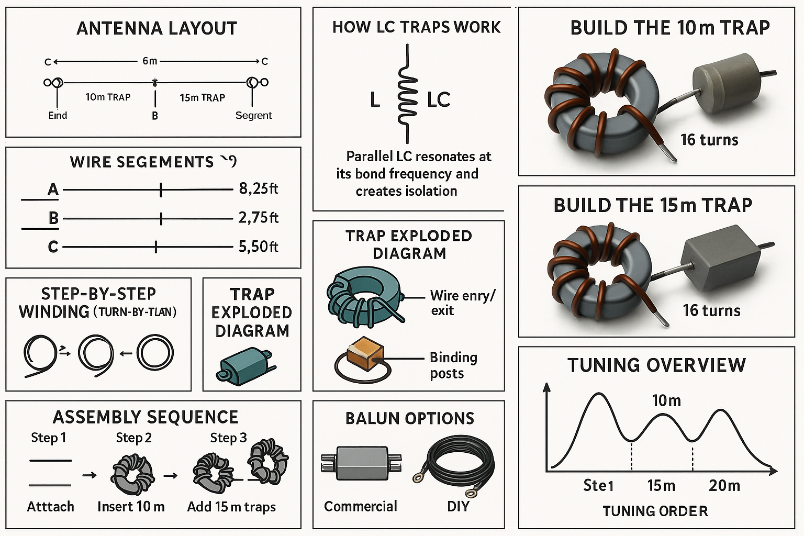
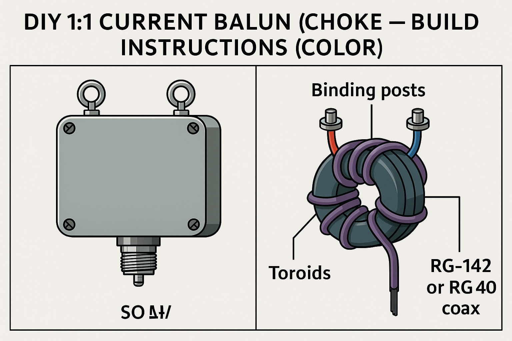

Center frequencies:  
20 m = **14.275 MHz** · 15 m = **21.350 MHz** · 10 m = **28.400 MHz**

---

# Color Legend (for diagrams)

- **Trap:** core = gray · winding = orange · Lead A = red · Lead B = blue  
  capacitor links = purple dashed · capacitor plates = black
- **Layout:** antenna wire = black · 10 m traps = green · 15 m traps = orange  
  feedpoint block = gray · DIY 1:1 balun = blue
- **NanoVNA:** NanoVNA = dark blue box · coupling loop = green dashed  
  trap = orange · coax/test leads = black
- **DIY balun:** enclosure = gray · toroids = gray · coax turns = purple  
  center path = red · shield path = blue

---

# Bill of Materials (DIY Build, 100–200 W)

## Antenna & Traps

- Ferrite toroids for traps: **FT240-61** (preferred) or **FT240-52**  
  *One per trap; stack two cores for long-duty digital modes.*
- Silver-mica capacitors:  
  - **22 pF** for 10 m traps  
  - **39 pF** for 15 m traps  
  *(Rated ≥ 2–3 kV)*
- Trap winding wire: **16–18 AWG** enamel or PTFE-insulated  
- Antenna legs: **14–16 AWG** stranded copper
- Hardware: ring lugs, FR-4 tabs, stainless fasteners, insulators, rope
- Weatherproofing: heat-shrink, epoxy or neutral-cure silicone, PTFE tape

## DIY 1:1 Current Balun (Choke)

- 2 × **FT240-31** (or **FT240-43**) toroids – stacked  
- **RG-142** or **RG-400** PTFE coax, 18–24 in (45–60 cm)
- **SO-239** bulkhead connector  
- Stainless eye bolts for antenna terminals  
- Weatherproof enclosure (6 × 4 × 2 in), hardware, sealant

---

# Trap Targets & Starting Values

| Trap | Target f₀ | Capacitor | Inductance | Turns (FT240-61) |
|------|-----------|------------|------------|-------------------|
| **10 m** | 28.400 MHz | 22 pF (≥ 2–3 kV) | ≈ 1.43 µH | ≈ **3 turns** (2 if stacked) |
| **15 m** | 21.350 MHz | 39 pF (≥ 2–3 kV) | ≈ 1.42 µH | ≈ **3 turns** (2 if stacked) |

---

# 📌 Trap Coil Turns (Important)

The number of turns depends on whether you use **one core** or **two stacked cores**.

### **15 Meter Trap (21.350 MHz)**  
- **Single FT240-61 core:** **≈ 3 turns**  
- **Two stacked FT240-61 cores:** **≈ 2 turns**

### **10 Meter Trap (28.400 MHz)**  
- **Single FT240-61 core:** **≈ 3 turns**  
- **Two stacked FT240-61 cores:** **≈ 2 turns**

These values produce the required inductances:  
- 10 m: **≈ 1.43 µH**  
- 15 m: **≈ 1.42 µH**

Stacked cores increase AL → fewer turns required.

---

# 10 m vs 15 m Trap – Quick Comparison

| Trap | Band Center | Cap Value | Target f₀ | Turns | Install Position |
|------|-------------|-----------|-----------|-------|------------------|
| **10 m** | 28.400 MHz | 22 pF | 28.400 MHz | 3 (2 stacked) | Closest to feedpoint |
| **15 m** | 21.350 MHz | 39 pF | 21.350 MHz | 3 (2 stacked) | Further from feedpoint |

---

# Trap Diagram (Color)

{width="6.0in"}

---

# Pre-Cut Lengths & Layout (Color)

| Section | Feet | Meters | Notes |
|---------|-------|--------|--------|
| Feedpoint → 10 m trap | 8.24 | 2.51 | Trim to center 10 m |
| 10 m trap → 15 m trap | 2.72 | 0.83 | Trim to center 15 m |
| 15 m trap → end (20 m) | 5.43 | 1.66 | Trim to center 20 m |

Total per-leg start length: **~16.39 ft**  
Final tuning requires small trims.

---

# Full Multi-Panel Overview (Color)

{width="6.5in"}

---

# Build Each Trap – Step by Step

1. Wrap toroid with PTFE tape (protects wire, improves Q).  
2. Wind **3 turns** (or **2 turns if stacked cores**).  
3. Solder silver-mica capacitor across coil ends — **keep leads short**.  
4. Add mechanical strain relief with lugs or FR-4 tabs.  
5. Weatherproof with heat-shrink and epoxy/silicone.

---

# Bench-Tune Traps with a NanoVNA (Color)

- **10 m target:** 28.400 MHz  
- **15 m target:** 21.350 MHz

Procedure:

- Place trap inside a **one-turn loose coupling loop**.  
- Observe **deep notch/dip** at resonant frequency.  
- Spread turns → **raise** f₀  
- Compress turns → **lower** f₀  
- Re-check after sealing.

{width="6.1in"}

---

# Assembly (Center-Fed With DIY 1:1 Current Balun)

1. Mount **1:1 current balun** at feedpoint.  
2. Attach balanced posts to each leg.  
3. Measure legs and install traps at correct distances.  
4. Insert 10 m traps at **8.24 ft** per side.  
5. Insert 15 m traps **2.72 ft** beyond the 10 m traps.  
6. Trim outer **5.43 ft** section for 20 m resonance.  
7. Raise antenna, ensure symmetry, and re-tune all bands.

---

# DIY 1:1 Current Balun (Choke) – Build Instructions

Recommended: **2 × FT240-31 cores (stacked)** for 20–10 m.

{width="6.1in"}

## Parts

- FT240-31 or FT240-43 toroids (2, stacked)  
- RG-142 or RG-400 coax  
- SO-239 connector  
- Stainless hardware  
- Weatherproof enclosure  
- Heat-shrink and sealant  

## Instructions

1. Stack toroids and secure with tape or epoxy.  
2. Drill enclosure for SO-239, terminals, and strain relief.  
3. Cut coax long enough for **10–12 turns** through both cores.  
4. Wind coax evenly through stacked cores — **smooth spacing**.  
5. Terminate coax to SO-239: center → pin, shield → body.  
6. Terminate opposite end to left/right antenna terminals.  
7. Add strain relief, seal openings, add drain hole.  
8. Label terminals; optionally add RF choke beads on feedline.

**Check:** SWR should remain stable when feedline is moved → confirms CMC suppression.

---

# Power Handling & Reliability (100–200 W)

- Use **FT240-61** for traps and **FT240-31** for the balun.  
- Silver-mica capacitors must be **≥ 2–3 kV**.  
- After tuning, key carrier — components may warm but must not run hot.  
- Add core volume or reduce power for digital modes with long duty-cycles.

---
